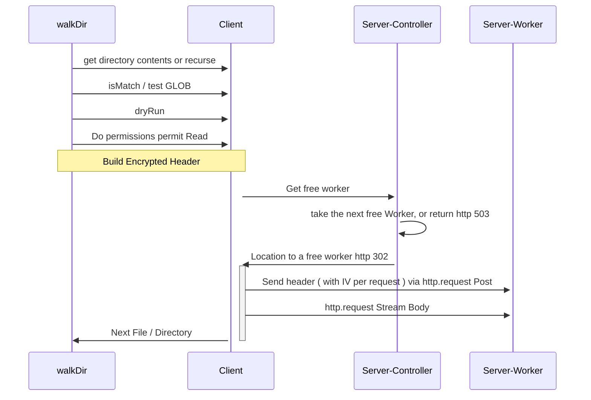

## Design 🛠️

## Encryption 🔑

You might wonder why this uses Symmetric Encryption vs Asymmetric, and that is to reduce the complexity of key exchange
and the need for a certificate authority. The encryption algorithm is aes-256-cbc, which requires an IV ( initialization
vector ), a Key, and Passphrase.

The header does not use an IV rather, it is a blank... but per request a random size and value Nonce is injected into
front of every payload ( effectively behaving like an IV ). The IV that is attached to the cipher payload in the header
is intended for the body... SO, at this point you might get excited and say "WHY WOULD YOU DO THIS!"

Let me explain, since it is possible to Man-in-the-middle a CBC without an IV, the Nonce in the header will deter an
attack as it is different every request, and a new IV ( intended for the body ) is generated per request and is attached
to the header payload because it is possible that the body may contain repeating content. Furthermore, capturing the
header and decrypting it, will reduce the surface of the attack only to the one request. The next request will have a
different Nonce and IV.
