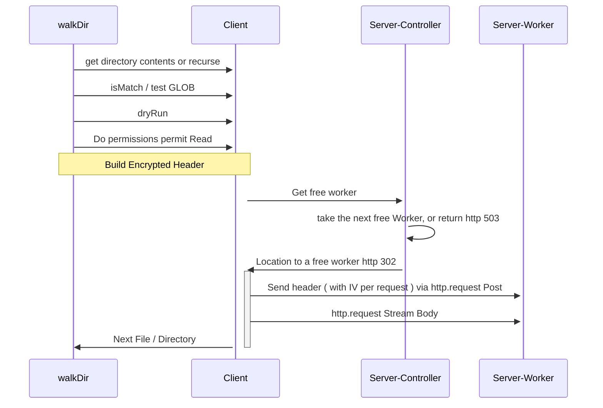

## Design 🛠️

## Encryption 🔑

You might wonder why this uses symmetric encryption instead of asymmetric encryption. The reason is to reduce the
complexity of key exchange and eliminate the need for a certificate authority. The chosen encryption algorithm is
AES-256-CBC, which requires an initialization vector (IV), a key, and a passphrase.

The header does not use an IV. Instead, it remains blank. However, upon request, a random-sized and valued nonce is
injected at the beginning of each payload, effectively behaving like an IV. The IV attached to the cipher payload in
the header is intended for the body. Now, you might be curious and ask, "Why would you do this?"

Let me explain. Since it is possible to perform a Man-in-the-Middle attack on a CBC mode without an IV, the nonce in
the header serves as a deterrent. It changes with every request, and a new IV (intended for the body) is generated for
each request and attached to the header payload. This approach accounts for the possibility of repeating content in the
body. Furthermore, capturing and decrypting the header reduces the attack surface to just that one request. The
subsequent request will have a different nonce and IV.
