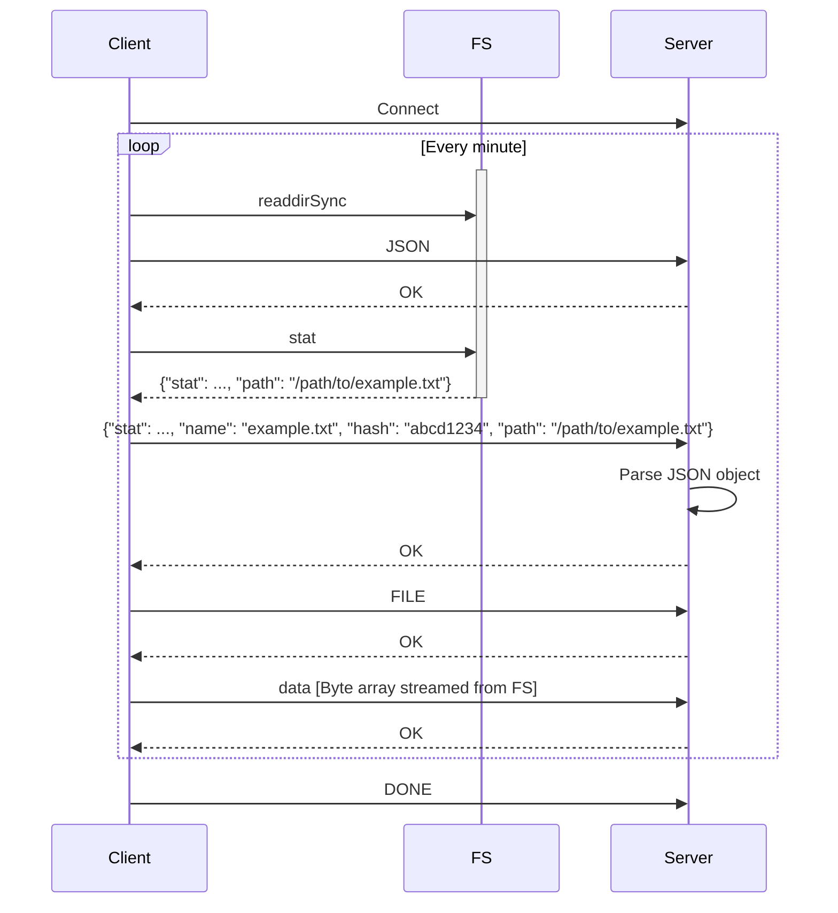

# squirt

> yet another peer to peer encrypted file transfer utilizing NodeJS Streams for the the most effective and stealth
> operation

## Flow

```mermaid
sequenceDiagram
    participant Client
    participant FS
    participant Server

    Client ->> Server: Connect
    loop Every minute
        activate FS
        Client ->> FS: readdirSync
        Client ->> Server: JSON
        Server -->> Client: OK
        Client ->> FS: stat
        FS -->> Client: {"stat": ..., "path": "/path/to/example.txt"}
        deactivate FS
        Client ->> Server: {"stat": ..., "name": "example.txt", "hash": "abcd1234", "path": "/path/to/example.txt"}
        Server ->> Server: Parse JSON object
        Server -->> Client: OK
        Client ->> Server: FILE
        Server -->> Client: OK
        Client ->> Server: data [Byte array streamed from FS]
        Server -->> Client: OK
    end
    Client ->> Server: DONE
```
